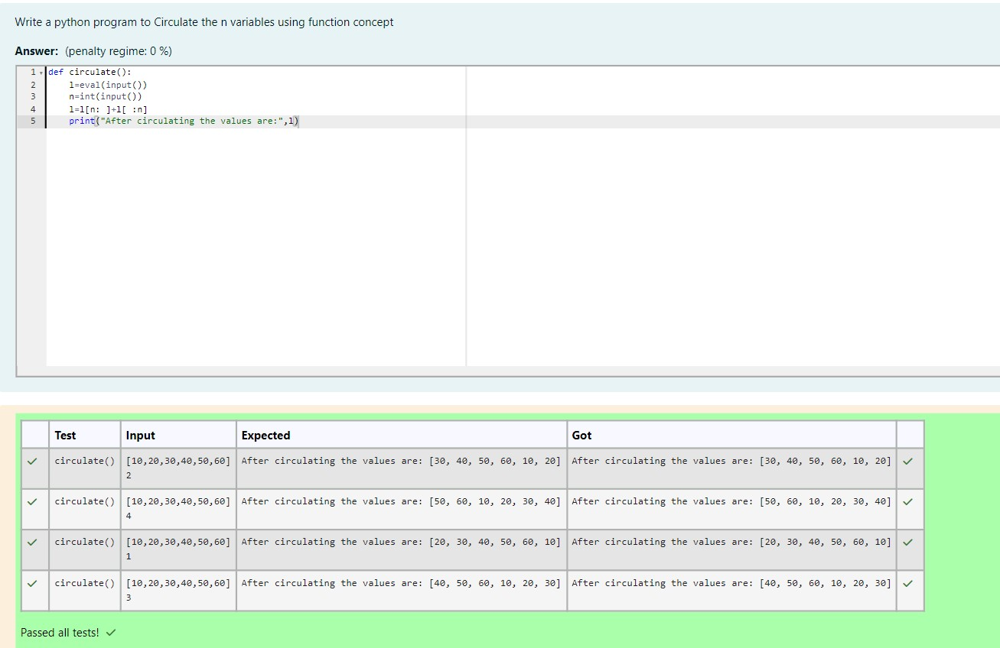

# Circulate-the-values-of-N-variables

## Aim:
To write a python program to circulate the n variables using function concept

## Equipment’s required:
PC
Anaconda - Python 3.7

## Algorithm: 

### Step 1: 
Get the values from the user

### Step 2: 
Assign the variable with a value

### Step 3: 
Get the value from the user for the number of rotation

### Step 4: 
Using the slicing concept rotate the list

### Step 5: 
Run the program and check the output

## Program:
```
Program to circulate N values.
Developed by : Easwari M
Register no : 212223240033
```

```
def circulate():
    l=eval(input())
    n=int(input())
    l=l[n: ]+l[ :n]
    print("After circulating the values are:",l)

```    

## Output:



## Result:

The output for the given program Circulate the values of n variables is successfully obtained.